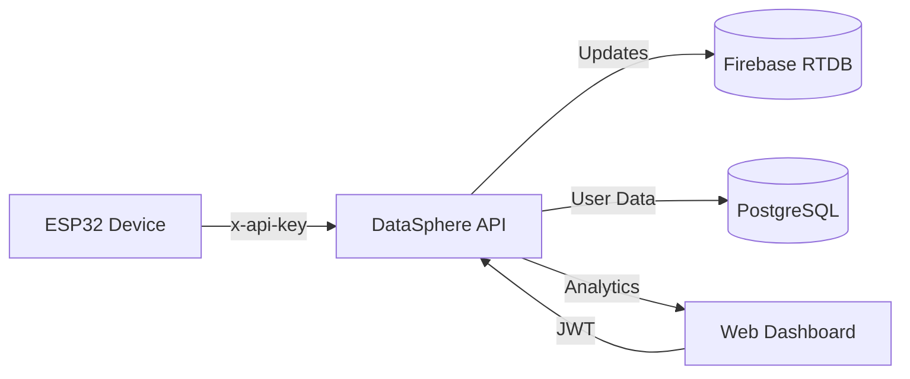

# 🌐 DataSphere API

**DataSphere API** is a robust IoT management and analytics platform designed for educational purposes. It serves as the backbone for university projects involving real-time monitoring of industrial-like sensors (RPM, Temperature) and device control.

Built with **NestJS**, **Hexagonal Architecture**, and **Domain-Driven Design (DDD)**, it demonstrates how to handle heterogeneous data sources (Postgres + Firebase) in a clean, scalable way.

---

## 🚀 Key Features

- **Real-time Monitoring**: Integration with **Firebase Realtime Database** for sub-second latency in sensor updates.
- **Relational Persistence**: PostgreSQL (via **Drizzle ORM**) for robust user management and session control.
- **IoT-Specific Security**: `x-api-key` authentication tailored for low-power devices like ESP32/Arduino.
- **Advanced Analytics**:
    - Current device state tracking (`on`, `off`, `operating`).
    - Cumulative duration calculation for operating hours.
    - Historical data aggregation (24h trends and weekly state stats).
- **Clean Architecture**: Strict separation of concerns using Ports and Adapters.

---

## 🏗️ Technical Architecture

The project follows a **Hexagonal Architecture** flow:



1.  **Domain**: Pure business logic (Entities like `DeviceData`, `User`).
2.  **Application**: Orchestrates business logic via **Use Cases** (Ports).
3.  **Infrastructure**: Concrete implementations (Adapters like `FirebaseKeyValueAdapter`, `DrizzleUserRepository`).

---

## 🛠️ Tech Stack

- **Backend**: [NestJS](https://nestjs.com/)
- **Infrastructure**:
    - **PostgreSQL**: Relational data (Drizzle ORM).
    - **Firebase**: Real-time sensor state and history.
- **Security**: Passport JWT (Users) & ApiKeyGuard (IoT Devices).
- **Testing**: [Vitest](https://vitest.dev/) for blazing fast unit and E2E tests.
- **Docs**: Swagger/OpenAPI (Access via `/api/docs`).

---

## 🚦 Getting Started

### 1. Requirements
- Node.js v20+
- Yarn
- Docker (for PostgreSQL)
- A Firebase Project (Realtime Database enabled)

### 2. Configuration
Copy `.env.example` to `.env` and fill in your Firebase credentials:
```env
# IoT Security
DEVICE_API_KEY=your_secret_esp32_key

# Firebase Configuration
FIREBASE_DATABASE_URL=https://your-project.firebaseio.com/
# ... other firebase vars
```

### 3. Execution
```bash
# Start PostgreSQL
docker-compose up -d db

# Install and start
yarn install
yarn start:dev
```

### 4. IoT Interaction Example
Devices can push data using a simple POST:
```bash
curl -X POST http://localhost:3000/devices/prototipo_01/data \
  -H "x-api-key: your-key" \
  -H "Content-Type: application/json" \
  -d '{"rpm": 1200, "temperature": 75.5, "status": "operating"}'
```

---

## 🧪 Verification & Testing

The project includes intensive E2E tests that simulate up to 7 days of historical data:

```bash
# Run E2E Device Diagnostics
yarn test test/e2e/device.e2e-spec.ts
```

---

## 🛡️ Educational Project
Developed for college application and IoT prototyping. Feel free to use and adapt for your university projects!
