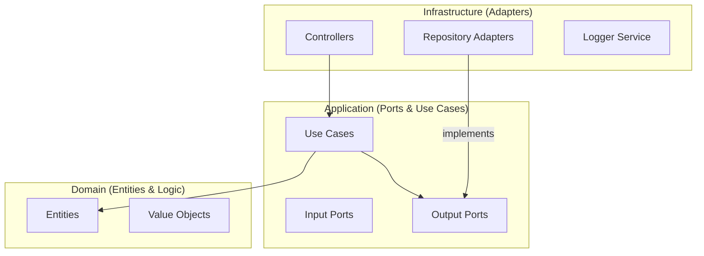

# 🏗️ Hexagonal Architecture

This project utilizes **Hexagonal Architecture** (also known as Ports and Adapters). The main goal is to isolate the core business logic (the "Heart" of the system) from external concerns such as databases, third-party APIs, or web frameworks.

## Layer Structure

### 1. Domain (Heart)
Located in `src/domain`. It has no dependencies on any other layer.
- **Entities**: Objects with a unique identity (e.g., `User`).
- **Value Objects**: Objects defined by their attributes, immutable.
- **Errors**: Specific business exceptions.

### 2. Application (Orchestration)
Located in `src/application`.
- **Use Cases**: Contain the orchestration logic for a specific functionality.
- **Ports**: Interfaces that define how the application communicates with the outside world.
    - **In**: Input ports (interfaces for Use Cases).
    - **Out**: Output ports (interfaces for repositories, external services, etc.).

### 3. Infrastructure (Details)
Located in `src/infrastructure`.
- **Adapters**: Concrete implementations of the **Output Ports** (e.g., `DrizzleUserRepository` implementing `UserRepositoryPort`).
- **Controllers**: Input adapters that receive HTTP requests and call the Use Cases.
- **Config**: Environment settings, variables, etc.

---

> [!NOTE]
> The golden rule is: dependencies always point inward. The Domain knows nothing about the application or infrastructure layers.
