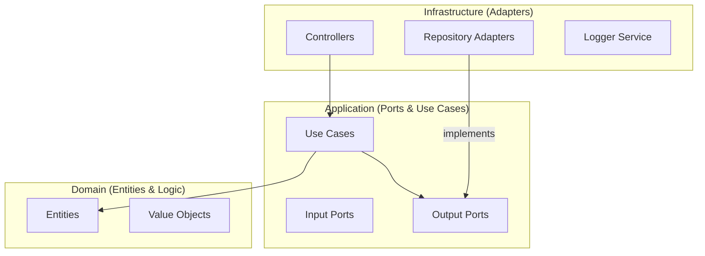

# 🏗️ Arquitetura Hexagonal

Este projeto utiliza a **Arquitetura Hexagonal** (também conhecida como Ports and Adapters). O objetivo principal é isolar a lógica de negócio central (o "Coração" do sistema) de preocupações externas, como bancos de dados, APIs de terceiros ou frameworks web.

## Estrutura de Camadas

### 1. Domain (Coração)
Localizada em `src/domain`. Não possui dependências de nenhuma outra camada.
- **Entities**: Objetos com identidade única (ex: `User`).
- **Value Objects**: Objetos definidos por seus atributos, imutáveis.
- **Errors**: Exceções específicas de negócio.

### 2. Application (Orquestração)
Localizada em `src/application`.
- **Use Cases**: Contêm a lógica de orquestração para uma funcionalidade específica.
- **Ports**: Interfaces que definem como a aplicação se comunica com o mundo exterior.
    - **In**: Portas de entrada (interfaces para os Use Cases).
    - **Out**: Portas de saída (interfaces para repositórios, serviços externos, etc).

### 3. Infrastructure (Detalhes)
Localizada em `src/infrastructure`.
- **Adapters**: Implementações concretas das **Output Ports** (ex: `DrizzleUserRepository` implementando `UserRepositoryPort`).
- **Controllers**: Adaptadores de entrada que recebem requisições HTTP e chamam os Use Cases.
- **Config**: Configurações de ambiente, variáveis, etc.

---

> [!NOTE]
> A regra de ouro é: as dependências sempre apontam para dentro. O Domínio não sabe nada sobre aplicação ou infraestrutura.
